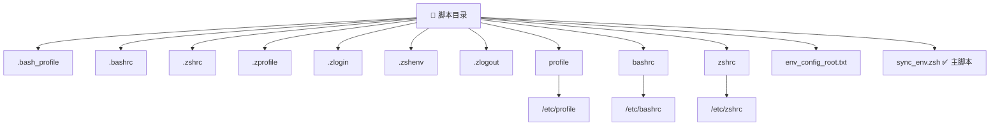
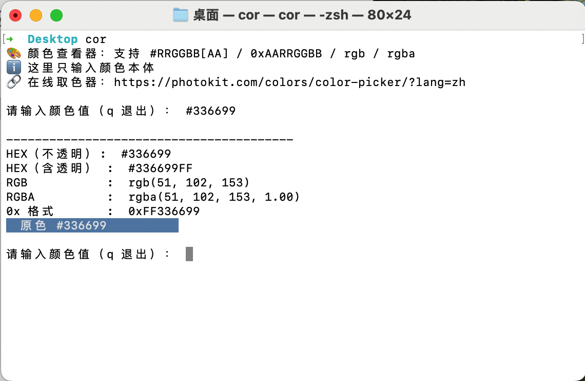
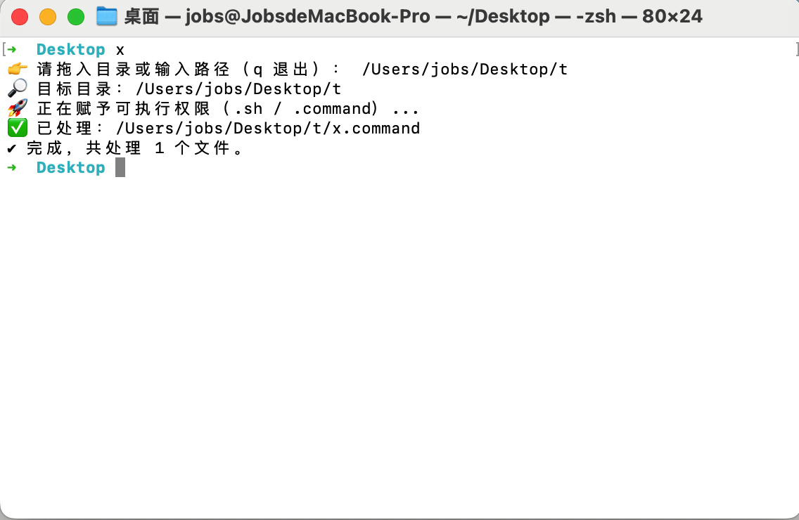

# 环境变量配置

[toc]

## 1、常见环境变量配置文件（按使用场景分类）

| 文件名                                              | 是否默认存在         | 作用                                      | 常用于哪些 shell                               |
| --------------------------------------------------- | -------------------- | ----------------------------------------- | ---------------------------------------------- |
| [~/.bash_profile](file:///Users/jobs/.bash_profile) | ✅                    | 登录 shell 启动时读取（如终端登录）       | `bash`（macOS 默认 shell 直到 macOS Catalina） |
| [~/.bashrc](file:///Users/jobs/.bashrc)             | ❌（需手动创建）      | 每次执行交互式 shell 时读取               | `bash`（常被 `.bash_profile` 调用）            |
| [~/.zshrc](file:///Users/jobs/.zshrc)               | ✅（Catalina 后默认） | 每次启动 `zsh` 时执行                     | `zsh`（macOS Catalina 起默认 shell）           |
| [~/.zprofile](file:///Users/jobs/.zprofile)         | ❌（可创建）          | 类似 `.bash_profile`，用于登录 shell      | `zsh`                                          |
| [~/.zlogin](file:///Users/jobs/.zlogin)             | ❌（可创建）          | 登录 shell 启动后读取（晚于 `.zprofile`） | `zsh`                                          |
| [~/.zshenv](file:///Users/jobs/.zshenv)             | ❌（可创建）          | **所有 zsh 启动时都会读取**，优先级最高   | `zsh`（即使非交互/非登录）                     |
| [~/.zlogout](file:///Users/jobs/.zlogout)           | ❌（可创建）          | 用户注销 zsh 时执行                       | `zsh`                                          |
| [/etc/profile](file:///etc/profile)                 | ✅                    | 所有用户的全局配置                        | 登录 shell                                     |
| [/etc/bashrc](file:///etc/bashrc)                   | ✅                    | 所有用户的全局 bash 配置                  | bash                                           |
| [/etc/zshrc](file:///etc/zshrc)                     | ✅                    | 所有用户的全局 zsh 配置                   | zsh                                            |

## 2、配置于`~/.zshrc`里面的自定义功能函数

### 2.1、重启终端（输入：rb）

### 2.2、打开 `.bash_profile`（输入：a）

### 2.3、打开 `.zshrc`（输入：b）

### 2.4、更新（输入：update）

### 2.5、打开iOS模拟器（输入：i）

### 2.6、颜色格式转换（输入：cor）

### 2.7、批量（递归）执行授权（输入：x）

### 2.8、Flutter打包iOS包（输入：ipa）

### 2.9、Flutter打包Android包（输入：apk）
